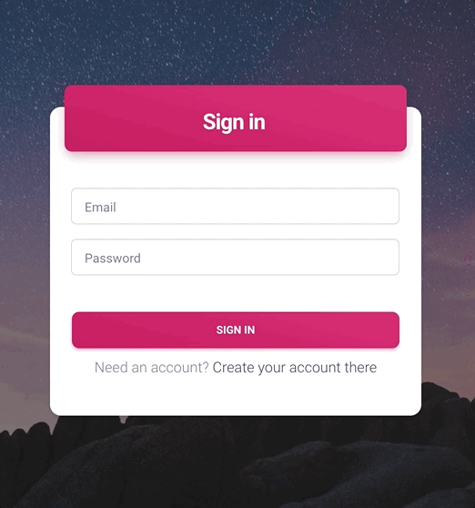
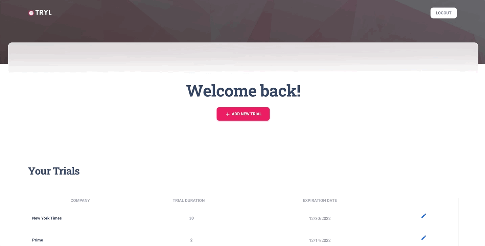

# Tryl
A class project by three NYU Stern Tech MBA students. A video demo is provided under the READ/WATCH folder - you can see our mid-point demo as of November 2022 and the final demo as of December 2022.

About Tryl
Tryl is the ultimate tool for managing your free trial subscriptions, no more worrying about being charged for a subscription you forgot to cancel! 

<h3>Current features:</h3>
<ul>
<li> Create Account: Ability to create a new user account with rules to ensure an email is provided, passwords match, and password meets requirement of at least 6 characters.</li> 
 
<li> User Login/Logout: Ability to login once user is created with authentication rules and ability to logout.</li> 
  
<li> Add a new trial: Add a new trial through modal-based form and see data displayed in table below.</li> 
 
</ul>

<h3>Future features:</h3>
<ul>
  <li>Email notifications about expiring trials</li>
</ul>

<h3>The Tech Stack</h3>
<ul>
  <li> Node</li>
  <li> Express</li> 
  <li> Passport</li>
  <li> Moment</li>
  <li> Bcrypt</li>
  <li> Mongoose</li>
  <li>Connect-Flash</li>
  <li>Session</li>
  <li>MongoDB</li>
</ul>
