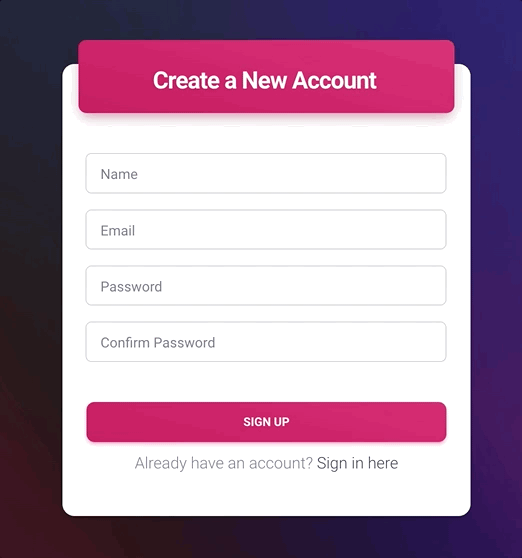

# Tryl

<h2>About Tryl</h2> 

Three NYU Stern Tech MBA students developed Tryl as a class project. This tool helps manage your free trial subscriptions and prevents you from being charged for a subscription that you forgot to cancel. Tryl allows you to create an account, log in, add a new free trial, and view previously submitted trials

 

<h3>Current features:</h3>
<ul>
 <li><b> Create Account:</b> Ability to create a new user account with rules to ensure an email is provided, passwords match, and password meets requirement of at least 6 characters.</li> 
 

  
 

 <li> <b>User Login/Logout:</b> Ability to login once user is created with authentication rules and ability to logout.</li> 
  

   
 

 <li> <b>Add a new trial:</b> Add a new trial through modal-based form and see data displayed in table below.</li> 
 

  
 

</ul>

<h3>The Tech Stack</h3>
<ul>
  <li> Node</li>
  <li> Express</li> 
  <li> Passport</li>
  <li> Moment</li>
  <li> Bcrypt</li>
  <li> Mongoose</li>
  <li> Connect-Flash</li>
  <li> Session</li>
  <li> MongoDB</li>
</ul>
